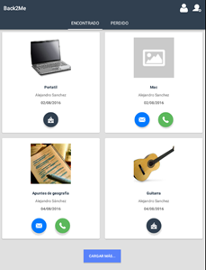
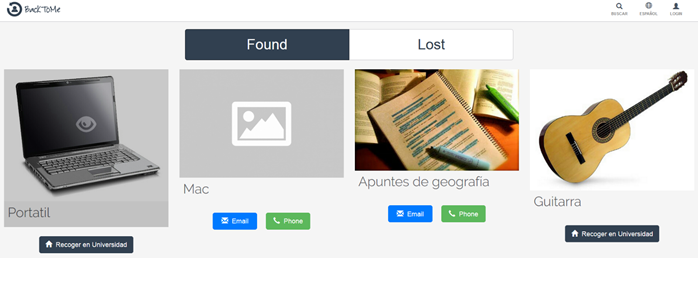

# Back To Me

Final Degree Project for my IT Engineering Master in 2016 in Universidad de Alicante.

Social network, Web & Mobile Application, for the management and search of lost object.

## Backend

REST Api made with PHP Phalcon Framework v7.3. It connects to a MySQL Database.

## Mobile App

Android application developed with Java and other Android Libraries 

## Frontend

Made with AngularJS and using the skeleton of Cliptwo Bootstrap Admin Template

### Use Grunt and Bower

install node.js
go to the root folder (Web) into the command line

>npm install -g grunt-cli
>npm install
>grunt bower-install-simple
>npm start

> grunt build:dashv
to build the 'dashv Version' folder